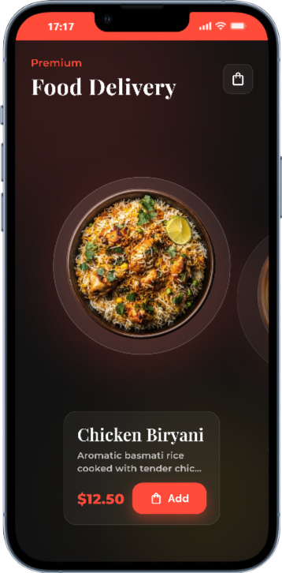
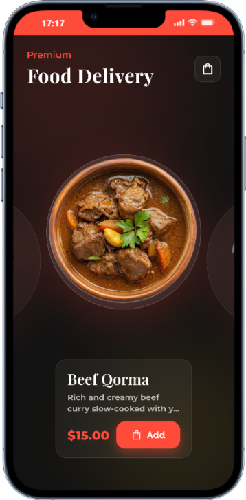
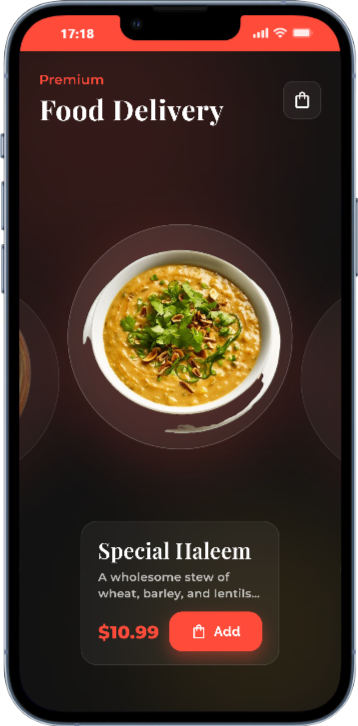
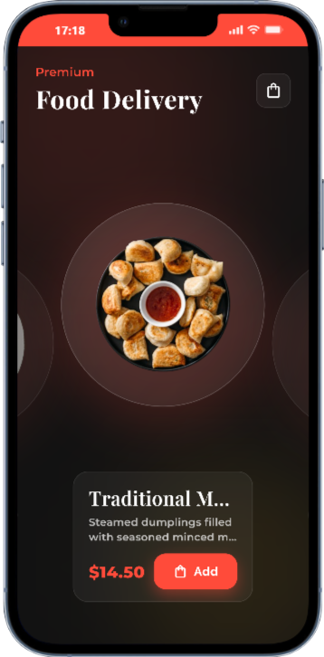
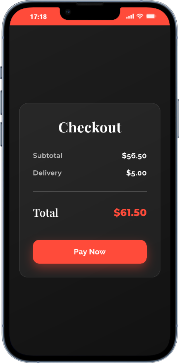
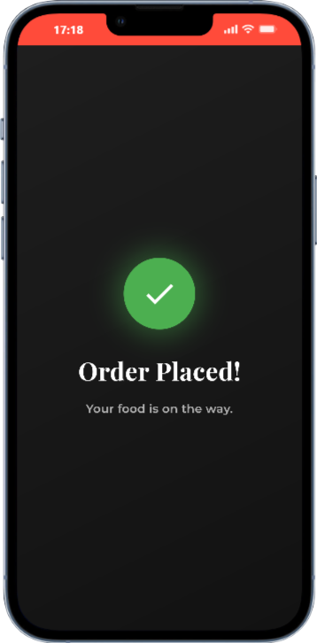

# 🍔 Premium Food Delivery App

A high-end, smooth-as-silk Flutter application designed for a premium food delivery experience. Featuring **Glassmorphism**, **3D-Transformed Animations**, and a sophisticated **Dark Theme**.


##  Features

- **Premium UI/UX**: Crafted with a deep black aesthetic and vibrant orange accents.
- **Curved Wheel Carousel**: A custom-built `PageView` with 3D rotation and translation for an immersive browsing experience.
- **Glassmorphic Elements**: Real-time blur and frosted glass effects across the UI.
- **Animated Interactions**: Micro-animations on buttons, staggered entrance effects, and playful success popups.
- **Hero Transitions**: Seamless shared-element transitions between the showcase and details screens.
- **Responsive Design**: Carefully handled layout constraints to prevent overflows on various screen sizes.

## 📱 App Screenshots

<div align="center">
  
  
  
</div>

<br/>

<div align="center">
  
  
  
</div>

---

## 🛠 Tech Stack

- **Flutter & Dart**: The core framework.
- **Google Fonts**: `Playfair Display` for luxury headers and `Montserrat` for modern body text.
- **Flutter Animate**: For sophisticated, high-performance animations.
- **Custom Components**: GlassContainers, SoftShadows, and Animated Buttons.


## 🚀 Getting Started

1. **Clone the Repo**:
   ```bash
   git clone <repo-url>
   ```
2. **Install Dependencies**:
   ```bash
   flutter pub get
   ```
3. **Run the App**:
   ```bash
   flutter run
   ```

